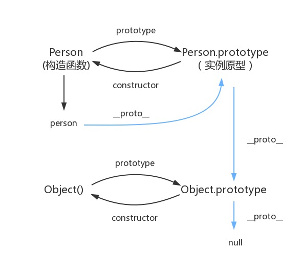

# 前端第六次上课

#### 复习基础

##### 基本类型

```javascript
Boolean
Null
String 
Undefined
Object 
Symbol(es6)
```

##### 操作符

```javascript
一元操作符
位操作符
布尔操作符
加减乘除 
```

##### 语句

```javascript
if
do while
while
for
for in
break
continue 
switch
```

##### 函数

```javascript
普通函数
构造函数
函数方法
```

##### 引用类型和基本类型

```javascript
后面讲
```

##### DOM

```javascript
var xxx = document.querySelector("xxxxx")
```

##### BOM

```javascript
clientWidth
clientHeight 
...
```

##### 事件

```javascript
click 
mouseover
mouseout
mousein
```

##### Ajax

#### 补充知识点

* **原型链**

  * 三个属性

    * prototype
    * \__proto__
    * constructor

  * 原型与实例

    ```javascript
    function Person(name,age) {
        this.name = name
        this.age = age
    }
    
    Person.prototype.sayName = function() {
        console.log(this.name)
    }
    
    var llp = new Person("llp",21)
    console.log(llp)
    ```

  * 原型链是什么? //下面解释

  * 为什么数组有数组方法？//写例子

  * 送一张图啊

    

* **作用域**

* **执行上下文**

  * 例子

    ```javascript
    //例子1
    var demo = function() {
        console.log(1)
    }
    demo()
    function demo() {
        console.log(2)
    }
    demo()
    //例子2
    function demo() {
        console.log(1)
    }
    demo()
    function demo() {
        console.log(2)
    }
    demo()
    ```

  * 执行上下文栈

    * 什么是栈?

    * 例子

      ```javascript
      function foo1() {
          console.log(1)
      }
      function foo2() {
          foo1()
          console.log(2)
      }
      function foo3() {
          foo2()
          console.log(3)
      }
      foo3()
      console.log(4)
      ```

    * 上一个例子发生了什么

      ```javascript
      // 创建一个Stack(栈)
      // 开始入栈
      Stack.push(globalContext) //全局执行上下文入栈
      //当调用foo3时
      Stack.push(foo3Context) //foo3的执行上下文入栈
      //调用foo2时
      Stack.push(foo2Context) //foo2的执行上下文入栈
      //调用foo3时
      Stack.push(foo1Context) //foo1的执行上下文入栈
      //入栈结束
      //此时 Stack = [globalContext,foo3Context,foo2Context,foo1Context]
      //出栈开始
      Stack.pop() // 执行 foo1,foo1Context 出栈
      Stack.pop() // 执行 foo2,foo2Context 出栈
      Stack.pop() // 执行 foo3,foo3Context 出栈
      //注意 globalContext永远存在，不用出栈
      ```

    * 活学活用,简单小测验

      ```javascript
      function foo1() {
          console.log(1)
      }
      function foo2() {
          console.log(2)
          foo1()
          console.log(3)
      }
      function foo3() {
          foo2()
          console.log(4)
      }
      foo3()
      console.log(5)
      ```

  * 

* **变量对象**

  * 全局对象(window)

  * 函数执行的过程

    * 进入执行上下文

      * 创建变量对象(activation object, AO)

    * 代码执行

      * 初始化变量对象

    * 例子

      ```javascript
      function foo(a) {
      	var b = 2
          function c() {}
          var d = function() {}
          b = 3
      }
      foo(1)
      
      //执行上下文入栈
      Stack.push(fooContext)
      //进入执行上下文
      var OA = {
          arguments: {
              0: 1,
              length: 1
          },
          a: 1,
          b: undefined,
          c: undefined,
          d: undefined,
      }
      //代码执行
      OA = {
          arguments: {
              0: 1,
              length: 1
          },
          a: 1,
          b: 2,
          c: reference to function c(){},
          d: reference to FunctionExpression "d",
      }
      ```

  * 小测验

    ```javascript
    function foo() {
        console.log(a)
        a = 10
    }
    function foo() {
        a = 10
        console.log(a)
    }
    ```

* **作用域链**

  > 当查找变量的时候，会先从当前上下文的变量对象中查找，如果没有找到，就会从父级(词法层面上的父级)执行上下文的变量对象中查找，一直找到全局上下文的变量对象，也就是全局对象。这样由多个执行上下文的变量对象构成的链表就叫做作用域链。

  ```javascript
  function foo() {
      var a = 100
      function bar() {
          var b = 20
          console.log(a)
      }    
      bar()
  }
  foo()
  ```

  * 为什么bar能访问foo中的变量?

    > 每个函数在创建时都会创建自己的作用域链(scope对象)
    >
    > 全局scope，没有 到顶了 
    >
    > foo的scope = [globalContext]
    >
    > bar的scope = [fooContext,...fooContext,……] //一直往上找 

  * 典型问题(闭包)

    ```javascript
    for(var i = 0; i < 5; i++) {
        setTimeout(function() {
            console.log(i)
        },1000)
    }
    for(var i = 0; i < 5; i++) {
        setTimeout(function(i) {
            return function xx() {
                console.log(i)
            }
    	}(i),1000)
    }
    
    //原因
    // 第二个function的scope增加了一个匿名函数,而不是全局对象
    // 第一个的scope = [glocalContext]
    // 第二个function的scope = [匿名函数的scope,globalscope]
    ```

* **垃圾回收机制**

* **参数的传递**

  * 按值传递

    ```javascript
    var name = "zzx"
    function changeName(_name) {
        _name = "sb"
    }
    changeName(name)
    console.log(name)
    ```

  * 引用传递

  * ```javascript
    var zzx = {
        name: "zzx"
    }
    function changeName(person) {
        person.name = "sb"
    }
    changeName(zzx)
    console.log(zzx)
    ```

  * 第三种传递

    ```javascript
    var zzx = {
        name: "zzx"
    }
    function changePerson(person) {
        person = 123
    }
    changePerson(zzx)
    console.log(zzx)
    ```

  * 传递的本质

    > * 拷贝参数
    >
    >   ```javascript
    >   //基本类型 => 传值 栈内存
    >   _name = name 
    >   //引用类型 => 传址 堆内存
    >   person和zzx共享空间 
    >   ```
    >
    > * 
    >
    > * 上面问题就解决了

#### 常用的方法补充

##### 数组的方法

```javascript
map
forEach
entries
filter
join
push
shift&&unshift
sort
reverse 
concat
slice 
splice 
indexOf 
lastIndexOf
filter
some
every
reduce
split
```

> 实战
>
> ```javascript
> var p1 = [{
>   name: "zzx",
>   age: 21,
>   money: 1000
> }, {
>   name: "kjj",
>   age: 20,
>   money: 1000
> }, {
>   name: "xc",
>   age: 19,
>   money: 1000
> }, {
>   name: "llp",
>   age: 22,
>   money: 1000
> }]
> 
> var p2 = [{
>   name: "zzx",
>   hobby: "sleep"
> }, {
>   name: "kjj",
>   hobby: "study"
> }, {
>   name: "xc",
>   hobby: "study"
> }, {
>   name: "llp",
>   hobby: "study"
> }]
> //获取喜欢学习，并且年龄大于等于20的同学，给他们100元
> ```

##### 正则(常见操作)

```javascript
String.prototype.replace(reg,"zzzz")
String.prototype.search(reg) 返回index
String.prototype.match(reg) 返回匹配的数组

RegExp.prototype.test(str)
RegExp.prototype.exec(str) 返回值为数组等信息


//
. * ? + () $1 [] | ^ $ \b \B \d \D \w \W 
```

##### git

```javascript
git add .
git branch 
git checkout -b
git checkout 
git log
git pull
git diff
git commit 
git push
```


### nodejs第一课

> https://www.kancloud.cn/kancloud/seven-days-nodejs/43580
>
> 具体的自己下去看一下啊... 时间不多，带你们走一遍简单api，学习更多是靠自己...

#### 什么是node

> JS是脚本语言，脚本语言都需要一个解析器才能运行。对于写在HTML页面里的JS，浏览器充当了解析器的角色。而对于需要独立运行的JS，NodeJS就是一个解析器。
>
> 每一种解析器都是一个运行环境，不但允许JS定义各种数据结构，进行各种计算，还允许JS使用运行环境提供的内置对象和方法做一些事情。例如运行在浏览器中的JS的用途是操作DOM，浏览器就提供了`document`之类的内置对象。而运行在NodeJS中的JS的用途是操作磁盘文件或搭建HTTP服务器，NodeJS就相应提供了`fs`、`http`等内置对象。

#### 作用

> NodeJS让前端众如获神器，终于可以让自己的能力覆盖范围跳出浏览器窗口，更大批的前端工具如雨后春笋。因此，对于前端而言，虽然不是人人都要拿NodeJS写一个服务器程序，但简单可至使用命令交互模式调试JS代码片段，复杂可至编写工具提升工作效率,简而言之就是让前端也能写后端...

#### 安装 

> 自己去看... 时间不多,这个不会我就... https://nodejs.org/en/download/

#### npm

> npm 是一个包管理软件,可以去第三方网站下载自己的包
>
> npm installl .... 

#### 相对路径和绝对路径

> 不必多说吧....

#### nodejs包的加载

> 内置模块(fs,http....),路径...

#### nodejs常用的包和api

* fs
  * fs.readFile(url,encode,callback)
  * fs.readFileSync(url,encode)
  * fs.writeFile(url,data,encode,callback)
  * fs.writeFileSync(url,data,encode)
  * fs.mkdir(url,callback)
  * fs.mkdirSync(url)
  * fs.unLink(url,callback)
  * fs.unLinkSync(url)
  * fs.readdirSync()
  * ....
* http
  * http.createServer(function(req,res){}).listen
  * http.request
  * http.get
  * req.headers
  * req.on("data",function() {})
  * req.on("end",function() {})
* 参数解析 
  * url.parse()
  * querystring.parse()

...剩下的自己下去了解吧，课不多了，node要自己下去学啊，暑假可能会用到哦...